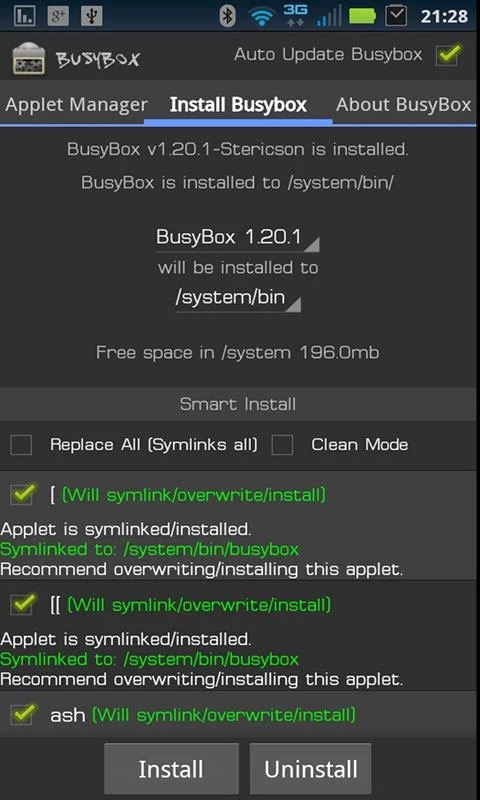

title: "modify files by adb shell /通过adb shell 修改文件"
date: 2015-05-25 20:44:25
tags: device
---


这里主要介绍root手机的下应用目录下具体文件的修改，比如shared_prefs目录下的share preference的配置文件。这里介绍两种方法。
一种通用方法，一种需要辅助工具来完成。
####方法一，试用 adb 的push和pull命令来完成。
    
```bash 
adb root #获取root权限
adb pull data/data/com.xxx.xxx/shared_prefs/xxx.xml . #导出xml文件到当前目录下
```
然后编辑导出文件，最后通过push命令导入

```bash
adb push xxx.xml data/data/com.xxx.xxx/shared_prefs/xxx.xml
```
这种方法优势在于通用，不用任何辅助工具来完成。

####方法二，通过busybox的应用来完成。
[busybox](http://www.busybox.net/)一个袖珍的unix工具包，有人把它移植到android,可以通过google play进行[下载](https://play.google.com/store/apps/details?id=stericson.busybox&hl=en)。
需要说明的是busybox需要root权限，因此对一些root管理权限的软件需要对其开放root权利。



busybox支持vi，所以这时候我可以随心所以的修改文件了。